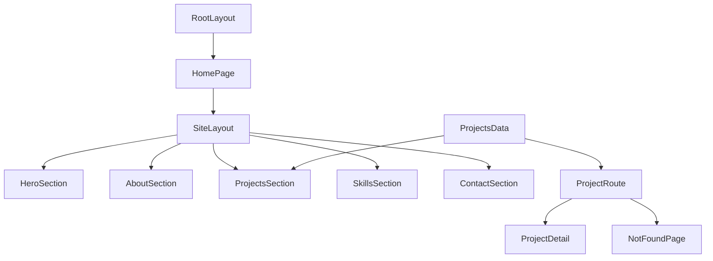

# Frontend Architecture Analysis Document

## 1) Architecture Snapshot

This project is a Next.js 14 App Router portfolio site that combines static data, animated client components, and route-level static generation for project detail pages.

- **Framework baseline**: App Router under `app/` with global shell in `app/layout.tsx`.
- **Main UX model**: Single-page section flow on `/` with anchor navigation and active-section tracking.
- **Project detail model**: Dynamic route `/projects/[slug]` statically generated from typed data.
- **Data strategy**: Domain project data is centralized in `data/`, while some section-specific content is colocated inside section components.

---

## 2) Directory Responsibilities

### `app/` (routing and route shells)

- `app/layout.tsx`  
  Root HTML shell and global metadata (`metadata`, `RootLayout`).
- `app/page.tsx`  
  Home composition (`Home`) that mounts `Layout`, `Hero`, `About`, `Projects`, `Skills`, and `Contact`.
- `app/projects/[slug]/page.tsx`  
  Dynamic project route with `generateStaticParams`, `generateMetadata`, and slug lookup logic.
- `app/projects/loading.tsx`  
  Loading fallback for project route transitions.
- `app/projects/not-found.tsx`  
  Custom not-found UI for invalid project slugs.
- `app/globals.css`  
  Global Tailwind layers and shared utility classes.

### `components/` (feature and section UI)

- `components/Layout.tsx`  
  Sidebar layout, mobile nav state, and `IntersectionObserver` based active-section tracking.
- `components/Hero.tsx`  
  Hero section with Framer Motion effects and CTA entry point to projects.
- `components/About.tsx`  
  Research/papers section with local content array.
- `components/Projects.tsx`  
  Project listing from shared data (`projects.map`), linking to project detail routes.
- `components/Skills.tsx`  
  Skills matrix and level styling helpers.
- `components/Contact.tsx`  
  Contact/social CTA section.
- `components/ProjectDetail.tsx`  
  Detail renderer for one `Project` entity.
- `components/characters/`  
  Reusable visual character components and barrel export in `components/characters/index.ts`.

### `data/` (typed content)

- `data/types.ts`  
  Domain type contract (`Project` interface).
- `data/projects.ts`  
  Aggregation entry for all project records (`projects: Project[]`).
- `data/projects/*.ts`  
  Individual project definitions split by file for modular updates.

### Root config files

- `package.json`: dependency and script definitions.
- `tsconfig.json`: TypeScript strictness and alias mapping.
- `tailwind.config.ts`: design tokens and Tailwind scanning.
- `postcss.config.mjs`: Tailwind/PostCSS plugin setup.
- `next.config.mjs`: Next.js runtime config.

---

## 3) Stack and Tooling Matrix

| Tool/Library | Role in Project | Where Configured/Used |
| --- | --- | --- |
| Next.js 14 (App Router) | Routing, SSG, metadata | `package.json`, `app/layout.tsx`, `app/page.tsx`, `app/projects/[slug]/page.tsx`, `next.config.mjs` |
| React 18 | Component architecture | `package.json`, all `app/` and `components/` files |
| TypeScript | Static typing and contracts | `tsconfig.json`, `data/types.ts`, typed props across components |
| Tailwind CSS | Utility-first styling + design system primitives | `tailwind.config.ts`, `app/globals.css`, class usage across components |
| PostCSS/Autoprefixer | CSS build pipeline for Tailwind output | `postcss.config.mjs` |
| Framer Motion | Scroll/entry animation and motion effects | `package.json`, `components/Hero.tsx`, `components/Layout.tsx`, and other section components |
| Path alias `@/*` | Cleaner imports and reduced relative path complexity | `tsconfig.json`, imports in `app/page.tsx`, `components/Projects.tsx`, `app/projects/[slug]/page.tsx` |

---

## 4) Runtime Flow

### Home Route (`/`) Flow

1. Request enters `RootLayout` in `app/layout.tsx`.
2. `app/page.tsx` renders `Home`.
3. `Home` composes:
   - `Layout` (structural shell and nav behavior)
   - Section components in order: `Hero`, `About`, `Projects`, `Skills`, `Contact`.
4. `Layout` monitors section visibility with `IntersectionObserver` and updates active nav item based on section `id`.
5. Internal section links (`#hero`, `#projects`, `#research`, `#skills`, `#contact`) drive smooth in-page navigation.

### Dynamic Project Route (`/projects/[slug]`) Flow

1. `generateStaticParams()` in `app/projects/[slug]/page.tsx` precomputes route params from `projects`.
2. `generateMetadata()` derives title/description from matching project.
3. `ProjectPage()` resolves `params.slug` against `projects`.
4. On match: renders `ProjectDetail` with the selected project object.
5. On miss: calls `notFound()`, rendering `app/projects/not-found.tsx`.
6. During transitions/loading states: `app/projects/loading.tsx` provides fallback UI.

### Flow Diagram

---

## 5) Data Flow and Contracts

### Domain Contract

- `Project` interface in `data/types.ts` defines required and optional fields consumed by both list and detail UI.
- This keeps project records aligned and minimizes schema drift.

### Project Data Assembly

1. Individual records are defined in `data/projects/*.ts`.
2. `data/projects.ts` imports and exports them as a single ordered `projects` array.
3. `components/Projects.tsx` consumes this shared array for listing.
4. `app/projects/[slug]/page.tsx` consumes the same shared array for route resolution.
5. `components/ProjectDetail.tsx` renders one `Project` entity passed as prop.

### Data Ownership Boundaries

- **Centralized cross-route data**: `data/projects.ts` and `data/projects/*.ts`.
- **Local section data**: arrays in `components/About.tsx` and `components/Skills.tsx` are colocated for section-level ownership.
- **Resulting model**: mixed strategy that is practical, but inconsistent from a strict data-layer separation viewpoint.

---

## 6) Component Interaction Notes

### Composition Graph

- `app/page.tsx` is the composition root for homepage sections.
- `components/Layout.tsx` provides a shared wrapper behavior for all sections.
- `components/Projects.tsx` is the key bridge between homepage and dynamic detail pages via slug links.

### Section-to-Section Interaction

- `Layout` navigation links map directly to section IDs.
- `Hero` includes CTA navigation into `Projects`.
- `IntersectionObserver` logic in `Layout` determines which section is active and synchronizes nav highlight state.

### Character Module Interaction

- `components/characters/index.ts` serves as barrel export, simplifying imports in consumer sections.
- Character components are decorative and presentation-focused, keeping business data concerns separate.

---

## 7) Modularity and Abstraction Evaluation

### Strengths

- Clear **route/UI/data** separation between `app/`, `components/`, and `data/`.
- `Project` type contract enforces consistent data usage between list and detail flows.
- Project records split into one-file-per-project supports modular scaling of content.
- Barrel export in `components/characters/index.ts` reduces import noise and improves maintainability.

### Coupling Points and Risks

- Section IDs and nav config in `Layout` are tightly coupled; mismatch risk exists if IDs change.
- Heavy use of client components for animation may increase hydration cost and client bundle size.
- Mixed data placement (some in `data/`, some in component files) can dilute source-of-truth clarity.
- A few internal navigation/link patterns can be normalized for better Next.js conventions.

### Abstraction Quality

- Current abstraction is suitable for a small-to-medium portfolio codebase.
- Data contracts are strong for project entities.
- UI behavior abstraction is mostly component-local and readable, though a few cross-cutting constants (section IDs, nav metadata) could be centralized.

---

## 8) Recommended Next Refactors (Prioritized)

1. **Centralize section metadata**  
   Move section IDs/hrefs into a single shared config to remove duplication between nav links and observer targets.

2. **Normalize internal route navigation**  
   Standardize internal links to Next.js idioms where appropriate for consistent client navigation behavior.

3. **Unify static content ownership strategy**  
   Decide whether section data (research/skills) should remain component-colocated or move into `data/` for consistency.

4. **Evaluate server/client split per section**  
   Keep highly interactive components as client-side, but consider server components for static-heavy sections to reduce hydration overhead.

5. **Add architecture guardrails**  
   Add a short contribution guide describing where to place new data, section IDs, and shared constants to preserve modularity over time.

---

## 9) Suggested Baseline for Next Phase

Use this document as the baseline for the next implementation phase:

- If your next goal is feature work, start by applying Refactors 1 and 2 first (low risk, high clarity gains).
- If your next goal is performance, prioritize Refactor 4 and measure bundle/hydration impact.
- If your next goal is maintainability, prioritize Refactors 1, 3, and 5 as a combined architecture cleanup pass.
